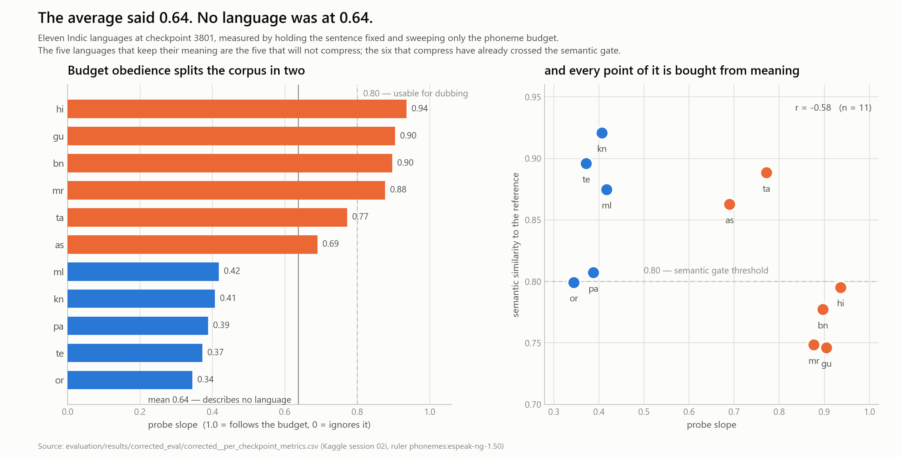

# Phase 02 — Corrected Evaluation Findings

**Kaggle session:** `nktthegreat/02i-corrected-eval` · Tesla T4×2 · 2026-08-04, ~5h45m wall
**Ruler:** `phonemes:espeak-ng-1.50` (both sides — labels and measurement)
**Corpus:** `val.phonemes.jsonl`, 1,650 rows, 11 languages
**Targets:** base model + checkpoints 2558, 3200, 3400, 3801
**Artifacts:** [`evaluation/results/corrected_eval/`](evaluation/results/corrected_eval/)

This is the first evaluation of the Phase 02 fine-tune in which the thing being asked for
and the thing being measured are the same quantity. Every number in
[`RULER_AUDIT_FINDINGS.md`](RULER_AUDIT_FINDINGS.md) said the previous evaluation was
measuring characters and calling them phonemes; this run replaces that measurement.

It was designed around two pre-registered, falsifiable predictions. **Both were wrong.**
What replaced them is a more useful result, and the mechanism that produced it is the
reason this project measures with a probe rather than a population regression.

---

## 1. The headline

The model does not have a length-control problem. It has a length-control problem in five
specific languages, and an aggregate that conceals it.



At checkpoint 3801, holding the sentence fixed and sweeping only the phoneme budget:

| | languages | probe slope | probe R² | semantic | degraded frac |
|---|---|---|---|---|---|
| **Follows the budget** | hi, gu, bn, mr, ta, as | 0.69 – 0.94 | 0.79 – 0.94 | 0.75 – 0.89 | 0.13 – 0.63 |
| **Ignores the budget** | ml, kn, pa, te, or | 0.35 – 0.42 | 0.51 – 0.67 | 0.80 – 0.92 | 0.10 – 0.43 |

The mean is 0.637. No language is near 0.637. There is an empty band from 0.42 to 0.69
with nothing in it.

The low-slope group also has **low R²** (0.51–0.67 against 0.79–0.94). That distinction
matters: a low slope with a high R² would mean "responds to the budget, but only
partially, and predictably" — a calibration problem, fixable by scaling the request. A low
slope with a low R² means the budget barely enters the model's decision at all. Output
length for ml, kn, pa, te, or is set by the sentence, not by the request.

### And this is invisible in the adherence number

`adherence_rel_mean` at 3801 is 0.117 aggregate, and per-language it ranges 0.085–0.173 —
Odia sits at 0.119, ninth of eleven, entirely unremarkable. Sampled Odia generations look
excellent:

| requested | produced | |
|---|---|---|
| 24 | 24 | ✓ |
| 47 | 44 | ✓ |
| 37 | 36 | ✓ |
| 42 | 40 | ✓ |
| 35 | 41 | ✓ |
| 30 | 31 | ✓ |

Odia's probe slope is 0.345. Both facts are true, and the reconciliation is the whole
point: **in the adherence test the requested budget is the reference translation's own
length**, so it sits near the length Odia would have produced anyway. A model that ignores
the budget entirely still scores well, as long as you only ever ask it for what it was
going to do.

Isochrony is precisely the case where you do not. You ask for 0.75× because the original
speaker said it faster. That is what the probe sweeps (0.6×–1.4×), and that is where five
of eleven languages stop following.

**Consequence for the project:** `adherence_rel_mean` cannot be the acceptance metric. It
is a fluency check. `length_slope_probe` is the acceptance metric, per language.

---

## 2. Prediction 1 — falsified: the model is not counting characters

The corpus was labelled with non-space character counts and the prompts said "phonemes"
(see [`RULER_AUDIT_FINDINGS.md`](RULER_AUDIT_FINDINGS.md), `frac_label_eq_chars = 1.00` in
all 11 languages). The natural prediction: the model learned "emit *N* characters", so
under a phoneme ruler its signed bias should track *k* − 1, where *k* is
phonemes-per-character.

| lang | *k* = ph/char | predicted signed | **observed signed** | residual |
|---|---|---|---|---|
| or | 1.1715 | +0.171 | **−0.022** | −0.194 |
| as | 1.1162 | +0.116 | **+0.029** | −0.088 |
| kn | 1.0580 | +0.058 | −0.003 | −0.061 |
| gu | 1.0428 | +0.043 | +0.012 | −0.031 |
| pa | 1.0391 | +0.039 | −0.011 | −0.050 |
| bn | 1.0283 | +0.028 | +0.009 | −0.019 |
| te | 1.0176 | +0.018 | −0.012 | −0.030 |
| hi | 0.9965 | −0.003 | −0.005 | −0.001 |
| mr | 0.9899 | −0.010 | +0.015 | +0.025 |
| ta | 0.9576 | −0.042 | −0.012 | +0.031 |
| ml | 0.9375 | −0.062 | **−0.143** | −0.081 |

r(*k*−1, signed) = **+0.44**, against a predicted +1.0 with unit slope. Odia — the language
with the largest units gap — shows essentially zero bias.

### The decisive test

A units error is a multiplication. So the harness re-ran checkpoint 3801 with every
language's budget rescaled by its own *k* (`--budget_scale_json`). If the model counts
characters, this converts the phoneme budget into the character budget it was taught and
the bias goes to zero.

| | mean \|signed\| | mean relErr | mean probe slope |
|---|---|---|---|
| corrected (no rescale) | **0.0248** | **0.117** | 0.637 |
| rescaled by *k* | 0.0430 | 0.125 | 0.636 |

Rescaling reduced \|signed\| in **2 of 11** languages and made the aggregate **worse**.
It moved the probe slope by 0.001.

**Conclusion:** the fine-tune learned a length-control behaviour that transfers across
rulers. Trained on character counts, measured in phonemes, it is already near-unbiased —
mean signed error −1.3%. The corpus mislabelling was real and had to be fixed, but its cost
was not a systematic bias in what the model produces. *The salvage-by-rescaling path is
closed*, and closed by measurement rather than by argument.

---

## 3. Prediction 2 — falsified: the reported error was not mostly label noise

Per-row label error against true phoneme counts ran 5.7%–11.1%, against a previously
reported model error of 10.3%. The prediction: much of that "model error" was noise in the
labels, so measuring against correct labels would show a materially better model.

Measured: **11.7%**. Slightly worse than 10.3%, not better.

The two numbers are self-consistent within their own units (asked in *X*, measured in *X*),
so the comparison is fair — and it says the model's error is real. The upside is the same
fact read the other way: transferring the model from the ruler it was trained on to a
different ruler costs only ~1.4 points, which is another form of the transfer evidence in
§2.

---

## 4. The trade-off that is actually there

r(probe slope, semantic similarity) = **−0.58**
r(probe slope, semantic-degraded fraction) = **+0.65**

The six languages that follow the budget are the six that damage meaning to do it —
Marathi degrades 63% of outputs past the 0.80 gate, Gujarati 57%, Bengali 53%, Hindi 50%.
The five that preserve meaning (Telugu 10% degraded, Kannada 13%, Malayalam 23%) do so by
declining to compress.

Two languages sit outside the pattern and are worth understanding before Session C:

- **Tamil** — slope 0.772 *and* semantic 0.888 with only 13% degraded. It is the one
  language getting both. It is also the largest gain in the run (base 0.283 → 0.772, +0.489).
- **Odia** — slope 0.345 *and* semantic 0.799 with 43% degraded. Worst of both. It is also
  the only language that got **worse** than the base model (0.574 → 0.345, −0.229).

Odia had the worst label corruption in the corpus (CV 0.272, *k* = 1.17, R² 0.841). It is
the one place where the evidence supports "training on character labels actively destroyed
a capability the base model had" — and it shows up in the slope, not in the bias.

### Per-language trajectory of the objective

| lang | base | 2558 | 3200 | 3400 | 3801 | base→end |
|---|---|---|---|---|---|---|
| gu | 0.376 | 0.926 | 0.874 | 0.889 | 0.905 | **+0.528** |
| ta | 0.283 | 0.721 | 0.772 | 0.787 | 0.772 | **+0.489** |
| as | 0.388 | 0.705 | 0.726 | 0.731 | 0.690 | +0.302 |
| bn | 0.646 | 0.851 | 0.889 | 0.802 | 0.897 | +0.251 |
| kn | 0.284 | 0.397 | 0.415 | 0.381 | 0.407 | +0.123 |
| pa | 0.289 | 0.383 | 0.390 | 0.375 | 0.388 | +0.099 |
| hi | 0.844 | 0.873 | 0.835 | 0.929 | 0.936 | +0.092 |
| te | 0.298 | 0.357 | 0.369 | 0.373 | 0.372 | +0.074 |
| ml | 0.419 | 0.421 | 0.398 | 0.414 | 0.418 | **−0.002** |
| mr | 0.891 | 0.808 | 1.004 | 0.854 | 0.877 | −0.014 |
| or | 0.574 | 0.280 | 0.327 | 0.316 | 0.345 | **−0.229** |

Malayalam moved by 0.002 across 3,801 steps. Whatever the fine-tune taught, Malayalam did
not receive it. Marathi was already at 0.891 before training and ended at 0.877 — for
Marathi the run was, at best, neutral.

---

## 5. Stopping verdict

```
CONTINUE — CE flat (delta +0.0001) but probe slope still climbing
           (0.623 -> 0.637, delta +0.014) between steps 3400 and 3801.
```

| checkpoint | step | CE | PPL | relErr | signed | chrF++ | semantic | **probe slope** | pop slope |
|---|---|---|---|---|---|---|---|---|---|
| base_model | −1 | 0.8118 | 2.388 | 0.565 | 0.344 | 21.3 | 0.735 | 0.481 | 0.630 |
| checkpoint-2558 | 2558 | 0.5149 | 1.716 | 0.138 | 0.013 | 30.4 | 0.833 | 0.611 | 0.653 |
| checkpoint-3200 | 3200 | 0.5114 | 1.708 | 0.125 | −0.017 | 30.1 | 0.822 | 0.636 | 0.651 |
| checkpoint-3400 | 3400 | 0.5127 | 1.710 | 0.141 | 0.034 | 30.2 | 0.817 | 0.623 | 0.688 |
| checkpoint-3801 | 3801 | 0.5128 | 1.712 | 0.117 | −0.013 | 30.3 | 0.829 | **0.637** | 0.684 |

Cross-entropy bottomed at step 3200 and moved by 0.0014 across the remaining 601 steps.
The probe slope kept rising. This reproduces the decoupling result under the corrected
ruler — it was not an artifact of the broken measurement.

Note the population slope in the same table: it reports 0.684 where the probe reports
0.637, and for Tamil it reports 0.508 where the probe reports 0.772. The two estimators
disagree in *both directions*, which is what a confounded estimator does. Selection on the
population slope would have picked differently.

---

## 6. What this run could not answer, and why

**No W&B curves.** The run logged nothing to Weights & Biases. Kaggle's secrets service
returned `Connection error trying to communicate with service` when the notebook requested
`WANDB_API_KEY`, and the pushed version treated a missing key as a warning for evaluation
runs. So a 5h45m session was unobservable while it ran — exactly the failure mode W&B is
there to prevent. Fixed for Session C: see §7.

**The raw sweep points were not saved.** `length_response.csv` stores the fitted slope and
R² per language, not the (requested, produced) pairs behind them. So the *shape* of the
response for the low-slope languages is unknown — whether they are flat throughout, or
follow the budget over part of the range and saturate. Those are different problems with
different fixes. Session C must persist the raw points.

**Why those five languages.** Not script family (Tamil and Malayalam are both Dravidian and
sit at opposite ends). Not inventory size (Punjabi has the largest at 119, Tamil the
smallest at 65; both break the pattern). Not phonemes-per-character. Not base-model slope —
Tamil and Gujarati started as low as Kannada and Punjabi and climbed anyway. Unresolved.

**Quota accounting.** The session consumed ~12.1 GPU-hours of the 30-hour weekly allowance
for ~5h45m of wall clock — a ratio of ≈2.1, consistent with T4×2 billing both GPUs. The
model is 8B in 4-bit and fits on one 16 GB T4, so the second GPU was almost certainly idle
and billed. Kaggle offers no single-T4 shape (the alternative, P100, is sm_60 and cannot run
this torch build). Plan Session C against **effective wall clock ≈ remaining quota ÷ 2**.

---

## 7. What Session C has to change

1. **Make W&B fatal, not advisory, and pass the key by environment rather than by Kaggle
   secrets.** The secrets service is a single point of failure that has now failed once, and
   the entity must be `nktthegreat-soccernet` — the personal `nktthegreat` namespace holds
   zero projects.
2. **Persist raw probe points** (`language, sentence_id, scale, requested_n, produced_n`)
   so the response curve is recoverable, not just its slope.
3. **Select on `length_slope_probe`, per language.** Neither the aggregate nor
   `adherence_rel_mean` distinguishes a model that follows the budget from one that
   reproduces the reference length.
4. **Do not raise the length weight globally.** r = −0.58 says a global push buys slope out
   of meaning, and the six high-slope languages are already at or past the 0.80 gate. The
   pressure has to be per-language, and it has to be paired with the semantic gate as a
   constraint rather than a report.
5. **Keep the sampling ratios.** The standing constraint holds: the languages that are
   overfitting need *less* fine-tuning, and reweighting toward the five stuck languages
   risks catastrophic forgetting in the six that work.
6. **Treat Odia as a regression, not a shortfall.** It is the only language below its base
   model. If the corrected corpus does not recover it toward 0.574, the cause is not the
   labels.

## Artifacts

| Path | Contents |
|---|---|
| `evaluation/results/corrected_eval/corrected__eval_report.md` | full per-language report, 5 targets |
| `evaluation/results/corrected_eval/corrected__per_checkpoint_metrics.csv` | 21 metrics × 11 languages × 5 targets |
| `evaluation/results/corrected_eval/corrected__trajectory_summary.csv` | aggregate trajectory |
| `evaluation/results/corrected_eval/corrected__length_response.csv` | probe slope and R² per language |
| `evaluation/results/corrected_eval/corrected__samples.jsonl` | 120 generations with chrF++ and semantic scores |
| `evaluation/results/corrected_eval/corrected__STOPPING_VERDICT.json` | machine-readable verdict |
| `evaluation/results/corrected_eval/rescaled__*` | the budget-rescale falsification test |
| `notebooks/02i_corrected_eval.ipynb` | the run, reproducible |
| `plot_budget_response.py` | the figure, and its table twin |
| `figures/budget_response_{light,dark}.png` | the two-population split |
